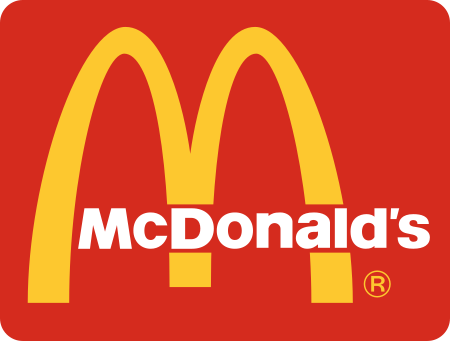

# McdonalsPage

<!-- PROJECT LOGO -->
 

  

  <h3 align="center">"McDonald's My version</h3>
    

    McDonald's Experience - Customize Your Meal 🍔 
     
    <a href="https://github.com/DragontitanB?tab=repositories"><strong>Explore the docs »</strong></a>
     
     
  

<!-- ABOUT THE PROJECT -->
## About The Project

<b>McDonald's Experience<b> is a web platform that allows you to personalize your McDonald's meal order. Explore our menu, choose from a variety of delicious options, and customize your burger, fries, and beverages to your liking. With McDonald's Experience, you have the freedom to create the perfect meal tailored to your taste buds. Say goodbye to one-size-fits-all fast food and enjoy a unique dining experience at McDonald's."

(<a href="#readme-top">back to top</a>)

### Built With

* [html]
* [CSS]
* [JavaScript]

(<a href="#readme-top">back to top</a>)

<!-- CONTACT -->
## Contact

Bryan Daniel - [@twitter_handle](https://twitter.com/brayanqo10) - Brayanqo10@gmail.com

Project Link: [@Proyect_Start](https://github.com/DragontitanB/WeatherPage/tree/a17542f8a47af2828bc985fce2eb624ce40b29ac)

(<a href="#readme-top">back to top</a>)

